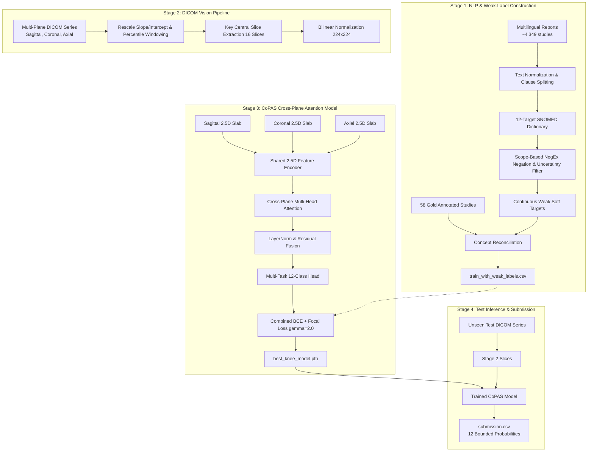

# RSNA Knee Abnormality Detection AI Challenge (Kaggle 2026)

[](https://www.kaggle.com)
[]()
[]()
[]()

---

## 📌 Executive Summary & Objective

This repository contains the end-to-end, competition-grade deep learning solution for the **2026 RSNA Knee Abnormality Detection AI Challenge** hosted on Kaggle.

The objective is to predict study-level probabilities for **12 clinically important knee abnormalities** using multi-plane knee MRI series (Sagittal, Coronal, and Axial). The project uniquely addresses severe data asymmetry: only a small fraction (~58 studies) of the training dataset contains direct gold labels, while ~4,349 studies provide unstructured, multilingual radiology reports from 16 international clinical sites across 5 continents. At test time, **no reports are provided**—the inference pipeline must run 100% vision-only within Kaggle's 9-hour runtime constraint.

---

## 🎯 Target Findings (12 Conditions)

1. **ACL** — Anterior cruciate ligament tear / injury
2. **MCL** — Medial collateral ligament tear / injury
3. **Medial Meniscus** — Medial meniscus tear / degeneration
4. **Lateral Meniscus** — Lateral meniscus tear / degeneration
5. **Medial OA** — Medial compartment osteoarthritis / cartilage loss
6. **Lateral OA** — Lateral compartment osteoarthritis
7. **PF OA** — Patellofemoral osteoarthritis / cartilage degeneration
8. **Effusion** — Joint effusion / excess fluid accumulation
9. **Synovitis** — Joint-lining inflammation / synovial thickening
10. **Baker's** — Baker's cyst / popliteal cyst
11. **Contusion** — Bone marrow contusion / bone bruise / trabecular edema
12. **Fracture** — Acute / avulsion / micro-fracture

**Evaluation Metric**: **Macro-averaged ROC-AUC** across all 12 targets.

---

## 📚 Scientific Literature Foundation (8-Paper Synthesis)

Our solution synthesizes key architectural and algorithmic insights from 8 landmark studies across knee MRI deep learning, medical vision-language pretraining, and clinical report NLP:

| Reference | Key Principle Applied in this Project |
| :--- | :--- |
| **Qiu et al. (2024, Nature Communications — CoPAS)** | **Multi-plane cross-attention fusion**: Encodes Sagittal, Coronal, and Axial planes simultaneously and applies multi-head attention to integrate inter-plane correlations before classification. |
| **Astuto et al. (2021, Radiology: AI)** | **Joint ROI coarse localization & Hierarchical cascade**: Focuses on anatomical sub-regions to eliminate empty background noise and decomposes severity into normal vs. abnormal gates. |
| **Li & Chang (2021, Radiology: AI)** | **Whole-joint multi-tissue AI integration**: Emphasizes that clinical utility requires unified multi-tissue assessment rather than isolated single-finding models. |
| **Wang et al. (2022 — MedCLIP)** | **Shared concept ontology & Soft-target pretraining**: Decoupled multimodal pairing that maps structured labels and report entities into a shared concept space. |
| **Das et al. (2025, npj Digital Medicine)** | **SNOMED-CT expansion & LLM weak-label bootstrapping**: Curated finding vocabulary expanded with medical synonyms for automated report extraction. |
| **Huang et al. (2021 — GLoRIA)** | **Multi-level feature alignment**: Multi-modal global and regional alignment between visual regions and pathology semantics. |
| **Zhang et al. (2022 — ConVIRT)** | **10x label efficiency via paired pretraining**: Unsupervised paired contrastive pretraining significantly reduces the requirement for expensive gold labels. |
| **Lu & Chen (2022)** | **Train-time distillation with test-time modality drop**: Uses radiology reports as distillation targets during training, then completely drops the text branch for 100% image-only inference at test time. |

### Filling the Critical Gap: Scope-Based Negation Detection
As identified across the literature, general LLMs and keyword matchers consistently fail on clinical negations (e.g., extracting *"fracture"* from *"No evidence of fracture"* or missing pathology in *"no significant interval change"*). This project incorporates a **dedicated scope-sensitive NegEx & uncertainty engine** (covering English, Spanish, German, French, Portuguese, and Italian) to eliminate false positives before labels are passed to the vision pipeline.

---

## 🏗️ 4-Stage System Architecture



---

## 📁 Repository Structure

```
├── .gitignore
├── PROJECT_STATUS.md                       # Detailed execution log and roadmap
├── README.md                               # Master technical documentation
├── notebooks/                              # Kaggle-ready standalone execution scripts
│   ├── 01_stage1_nlp_weak_labels.py        # Stage 1: Multilingual NegEx report parser
│   ├── 02_stage2_submission_baseline.py    # Stage 2: DICOM loader & submission baseline
│   ├── 03_stage3_copas_training.py         # Stage 3: CoPAS multi-plane GPU training
│   └── 04_stage4_final_submission.py       # Stage 4: Test inference with trained weights
└── src/                                    # Modular Python library
    ├── nlp/
    │   ├── weak_label_engine.py            # Multilingual NegEx entity & uncertainty extractor
    │   └── test_weak_label_engine.py       # Unit tests (100% pass across EN, ES, DE, FR)
    ├── vision/
    │   └── dicom_loader.py                 # Fast DICOM reader, windowing & slice sampler
    ├── models/
    │   └── copas_network.py                # CoPAS multi-plane cross-attention network
    └── training/
        └── loss_functions.py               # Combined Focal + BCE Loss (gamma=2.0)
```

---

## 🚀 Reproduction & Kaggle Execution Guide

### Step 1: Generate Weak Labels (Stage 1)
* **Script**: [`notebooks/01_stage1_nlp_weak_labels.py`](notebooks/01_stage1_nlp_weak_labels.py)
* **Kaggle Notebook**: `rsna-knee-stage1-weak-labels`
* **Hardware**: CPU (finishes in < 60 seconds).
* **Output**: `train_with_weak_labels.csv` with extracted continuous probabilities for all ~4,400 studies.

### Step 2: Train CoPAS Multi-Plane Model (Stage 3)
* **Script**: [`notebooks/03_stage3_copas_training.py`](notebooks/03_stage3_copas_training.py)
* **Kaggle Notebook**: `rsna-knee-stage3-training`
* **Hardware**: GPU (T4 x2 or P100), Internet: OFF.
* **Architecture**: CoPAS cross-plane attention + Combined Focal/BCE Loss with mixed precision (`torch.amp`).
* **Output**: `best_knee_model.pth`.

### Step 3: Run Inference & Submit (Stage 4)
* **Script**: [`notebooks/04_stage4_final_submission.py`](notebooks/04_stage4_final_submission.py)
* **Kaggle Notebook**: `rsna-knee-submission-baseline`
* **Inputs**:
  1. Competition Dataset (`RSNA Knee Abnormality Detection`)
  2. Trained weights (`rsna-knee-stage3-training` output attached via *+ Add Input*)
* **Hardware**: GPU T4, Internet: OFF.
* **Output**: Strictly compliant `submission.csv` containing study IDs and 12 target probabilities.

---

## ⚖️ Competition Rules & License
* **Dataset**: Subject to RSNA Competition Rules.
* **Code License**: Open-source under **CC-BY-NC 4.0** per competition guidelines.
* **External Pretrained Models / Libraries**: All architectures comply with OSI-approved licenses and Kaggle code competition submission requirements.
